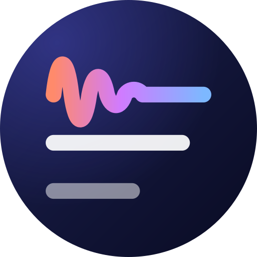
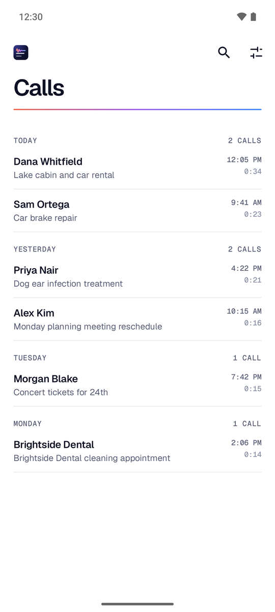
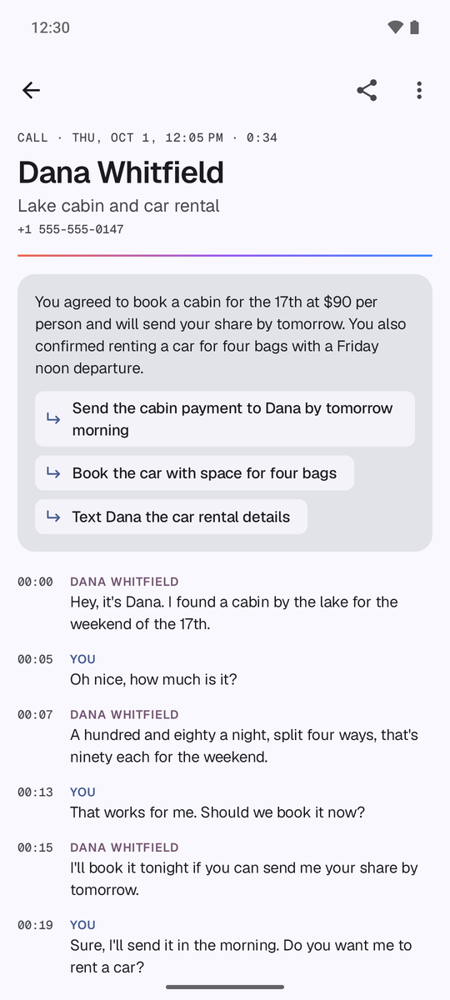
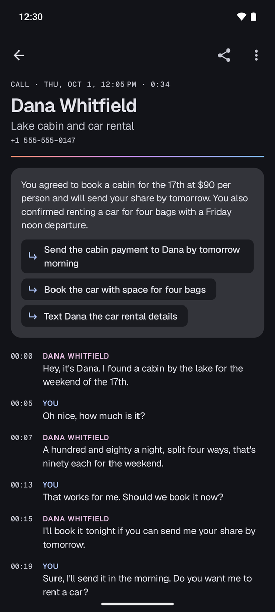

<p align="center">
  
</p>

<h1 align="center">Longhand</h1>

<p align="center"><em>Get it in writing.</em></p>

<p align="center"><a href="https://github.com/christiantwu/longhand/releases/latest"><b>Download the latest APK</b></a></p>

Longhand turns your recorded phone calls into transcripts you can read, search and share:
who said what, when, and a short summary of what was agreed. It's made for GrapheneOS,
whose Phone app can record calls, and it does all its work on the phone. There's no account
and no server, and nothing is uploaded.

<p align="center">
  
  
  
  <br><sub>The calls in these screenshots are made up.</sub>
</p>

## What it does

- **Transcribes calls automatically,** about a minute after each one ends, or only while
  charging if you prefer.
- **Shows who said what.** Speakers are told apart by their voices, and every turn has a
  timestamp. Mark your own voice once and Longhand labels you "You" in every call.
- **Names the caller** from your call log and contacts, if you allow it.
- **Summarizes each call** with a topic line, a short summary and any follow-ups, written
  by a small language model on the phone in the language of the call. Summaries are optional.
- **Plays any line.** Tap a line to hear that moment of the recording.
- **Fix what it got wrong.** Long-press a line to edit it, split it, or give it to someone
  else, and add common corrections, like “UV” → “Youvee”, for every new transcript.
- **Search and share.** Search by name, topic or words. Share a transcript as text or
  Markdown, or share the recording itself.
- **Languages:** English, 25 European languages, Chinese, Japanese and Korean, or Hindi (with
  English, including calls that mix the two). Keep two or more, and each call is transcribed in
  the one it's in. Summaries are written in the call's language too. That was tested in German,
  Spanish, French, Swedish, Polish, Chinese, Japanese, Korean, Hindi and Hindi-English, and all
  of them were good enough to keep. The other European languages are summarized in their own
  language too, but haven't been tested. Naming a European call's language takes language
  detection (two or more languages kept, with **Detect each call's language** on); without it a
  European call is asked for "the language the call is in", which sometimes still gives English
  (Swedish did in the tests), and one with almost no letters beyond ASCII is summarized in English.

## Privacy

- Speech recognition and summaries run on the phone's processor. Once the models are
  downloaded, you can turn off Longhand's Network permission.
- Longhand never records calls. It only reads the folder you choose.
- The Phone, call log and contacts permissions are optional. They let Longhand notice
  when a call ends and name the caller.
- Transcripts stay in the app's private storage. They're included in backups you turn on
  yourself, such as Seedvault.
- To tell speakers apart, Longhand stores a voice fingerprint for each speaker in a call, and
  one of your own voice if you mark it. They're stored and backed up like the transcripts.
- With Recognise voices turned on in Settings (it's off by default), Longhand also keeps a
  voiceprint for each person you name, to suggest their name in other calls. You can forget
  them one by one or all at once.

## Requirements

- GrapheneOS, with call recording turned on in the Phone app. Longhand can watch any
  folder, so other Android 12+ phones that save call recordings to a folder may work too,
  but that's untested.
- A 64-bit ARM phone.
- Storage for the models: 0.3–0.75 GB for transcription, 0.24–0.69 GB more for each further
  language you keep (and 0.16 GB to detect each call's language once you keep two), plus 2.6 GB
  for summaries.
- For the best accuracy, record calls as WAV: in the Phone app's settings, turn on
  "Use call recording V2 (experimental)", then choose WAV as the recording format.
  Compressed recordings are transcribed noticeably less accurately.

## Install

Download `longhand-<version>.apk` from the
[latest release](https://github.com/christiantwu/longhand/releases/latest). Release APKs are
signed with this certificate (SHA-256):

    10:33:66:AD:3D:78:A9:AC:CC:71:AC:03:41:B4:88:4F:6D:17:31:18:CF:7D:BA:7A:43:44:5C:CC:AF:07:6E:27

Recording calls may need the other person's consent where you live. Transcripts and
summaries can contain mistakes, so check anything important against the recording.

## Models

- **Speech-to-text:** NVIDIA Parakeet TDT 0.6B v2 (int8, with its encoder re-quantized by Longhand,
  see below) for English, or, chosen in Settings, Parakeet TDT 0.6B v3 (int8, its encoder
  re-quantized the same way) for 25 European languages, detected per call: Bulgarian, Croatian,
  Czech, Danish, Dutch, English, Estonian, Finnish, French, German, Greek, Hungarian, Italian,
  Latvian, Lithuanian, Maltese, Polish, Portuguese, Romanian, Russian, Slovak, Slovenian, Spanish,
  Swedish and Ukrainian. Or SenseVoice Small (int8) for Chinese (Mandarin and Cantonese), Japanese,
  Korean and English, also detected per call. Or NVIDIA Nemotron 3.5 ASR Streaming 0.6B (int8,
  1120 ms chunks) for Hindi and English, detected for each turn, including calls that mix them;
  English words in Hindi sentences are written in Devanagari. Each one you download stays on the
  phone until you remove it, so switching back is instant; while a new choice downloads, the one
  used before keeps transcribing.
- **Who spoke when:** pyannote segmentation 3.0 + NeMo TitaNet speaker embeddings
- **Pause detection:** Silero VAD
- **Language detection:** OpenAI Whisper base (int8, sherpa-onnx's conversion, MIT), only with two
  or more languages downloaded
- **Speech runtime:** [sherpa-onnx](https://github.com/k2-fsa/sherpa-onnx) 1.13.8 (ONNX Runtime, CPU)
- **Summaries:** Qwen 3.5 4B (Q4_0 GGUF, Apache 2.0) run by
  [llama.cpp](https://github.com/ggml-org/llama.cpp) b11308, compiled into the app

The models are downloaded from the setup screen: the speech models for the chosen language
(~720 MB for English, ~730 MB for the European languages, ~290 MB for Chinese, Japanese and
Korean, or ~730 MB for Hindi, the speaker models included; required) and the summary model
(~2.6 GB, optional). Choosing another language later in Settings downloads its recognizer
(240–690 MB) while the one used before keeps transcribing, and both stay: switching to a language
already downloaded is instant, and **Remove** next to it in Settings frees its space. A download
left unfinished when you choose another language is deleted. Once a second language is in, the
language detection model (~160 MB) follows, unless **Detect each call's language** is off; it's
deleted when you turn that off or keep only one language. Downloads wait for Wi-Fi (an
unmetered connection) unless you choose to go ahead on mobile data or a metered network. After
that you can turn off the app's Network permission in GrapheneOS. Summaries are written in the
language of the call, or all in English with **Write summaries in the call's language** turned
off in Settings.

**The English and European languages encoders are Longhand's own.** sherpa-onnx's int8
conversions of Parakeet v2 and v3 quantize every convolution in the encoder, and that costs
accuracy, most of all on phone audio. Longhand quantizes sherpa-onnx's full-precision conversions
itself, keeping the whole pre-encode (subsampling) stage and the depthwise convolutions in full
precision (`tools/requantize_parakeet.py`), and downloads the results from its own
[GitHub release](https://github.com/christiantwu/longhand/releases/tag/models-1). The decoders,
joiners and tokens are sherpa-onnx's, unchanged. The European languages model needed this most: on
FLEURS, across all 25 languages, the word error rate fell from 18.1% to 11.9% on wideband audio and
from 34.0% to 14.9% on audio coded like the Phone app's default recordings; no language got worse.
For English, on recorded phone conversations coded like the default recordings, it fell from 7.7%
to 6.9%, about 11% fewer errors, with smaller gains elsewhere. Both are also about 30% faster in
desktop tests. Phones that downloaded English or the European languages with an earlier version
keep transcribing with the old encoder while the new one (~670 MB) downloads over Wi-Fi, and the
old one is deleted once the new one is in and checked. A language kept on the phone but not chosen
gets its new encoder when you choose it again. If you turned off the Network permission, turn it
back on for the update.

**The Hindi model comes from Longhand's release too, unmodified.** sherpa-onnx publishes its int8
conversion of Nemotron 3.5 ASR Streaming only inside one archive, so Longhand hosts the encoder,
decoder, joiner and tokens from it, byte for byte, on the same
[GitHub release](https://github.com/christiantwu/longhand/releases/tag/models-1). On FLEURS Hindi its
word error rate is 13.6% on wideband audio and 17.9% on audio coded like the Phone app's default
recordings, and it recognises about 85% of the English words in Hindi-English speech. In desktop
tests of the model, recognition took about 1.8 times as long as the European languages model.

## How it works

1. **Finding new recordings.** `CallEndedReceiver` hears the phone go idle after a connected call.
   This needs the Phone permission (READ_PHONE_STATE), which Android describes as "make and
   manage phone calls"; Longhand only reads the call state. With call log access, Android sends
   each change a second time with the number attached; Longhand ignores that copy.
   `AfterCallWorker` (an expedited job) then waits 75 s and checks the folder; another call
   restarts the wait. A periodic check also runs every 15 minutes and whenever the app opens.
   Files count as finished once they've been unchanged for a minute, so a call in progress
   isn't transcribed half-written. With the Phone permission, heavy work never starts during a call.
   - **Caller lookup:** with call log access, each recording is matched to the call that ended
     just before the file was written (`CallMatcher`). The number is then looked up in
     Contacts. Without call log access it falls back to a phone number in the file name. In a
     transcript, **⋮ → Who was this call with?** picks the contact by hand.
2. `TranscribeWorker` processes the queue, either right after each call (the default) or only
   while charging (a setting). On battery, automatic runs handle the last day's calls; older
   recordings, such as an imported backlog, wait for the charger unless you tap Transcribe now.
   Work that waits for the charger starts at the next folder check after you plug in, within
   about 15 minutes. When an update changes how speakers are found, every earlier transcript is
   redone once on the charger, after new calls. The old transcript stays until its replacement
   is ready, and redos don't send a notification.
   Each recording is transcribed in the language chosen in Settings, or, while that one downloads,
   in the one used before (`Models.recognizer`), so a switch to a language already on the phone
   takes effect from the next recording.
   - **Detecting each call's language** (with two or more languages on the phone; on by default,
     under Settings → Transcription language): each call is transcribed in the downloaded language
     it's in (`engine/CallLanguage.kt`). The call's speech is whatever speaker separation (below)
     hears anyone say, padded as for transcription; it also catches quieter or noisier voices that
     Silero VAD misses on phone audio. That speech is cut into 9 s pieces (a last piece of 4 s or
     more is kept), and Whisper base names the language of the first, middle and last piece (of
     each, with three or fewer). A call goes to another model when two of those windows (or the only
     one) are in its languages, or when one is and the rest are English, as in a call that mixes
     Hindi and English; it stays when more than one window is in a language no model covers, or when
     two other models' languages are heard, unless it's two windows to one. When every window is
     English, the call goes to the English model, the most accurate for English, though every other
     model transcribes English too. A call with under 10 s of speech follows Settings, and so does
     one in a language that isn't downloaded. Whisper hears Maltese as Arabic, so a Maltese call
     stays with Settings' language too. The windows and the rule were chosen on 1,064 test calls
     coded like the Phone app's recordings, to move a call only when that's all but certain to
     transcribe it better.
     Each call is detected once (and again if its file changes); one that crashes the app while
     it's detected follows Settings instead of being detected again. What was heard is kept, and the
     language is decided afresh whenever the call is transcribed, since the languages downloaded and
     Settings can change. Calls that arrive before the detection model has downloaded follow
     Settings without waiting. Whisper and a recognizer are never in memory together: when a call
     needs detecting, the recognizer is unloaded, up to 8 waiting calls are detected in one go (so
     a call you ask for meanwhile isn't kept waiting behind a long backlog), and Whisper is
     released before transcription carries on. Speaker separation (models of about 50 MB, the same
     for every language) stays loaded throughout, and the speakers it finds while detecting a call's
     language are kept for transcribing it, so the slowest step isn't done twice. A transcript that
     detection put in another language than Settings' says which language was heard in its
     header, like "JAPANESE".
   - **Transcribe again:** with more than one language on the phone, **⋮ → Transcribe again** asks
     which to use for that call. The language picked stays with the call for its later
     transcriptions too, as long as it's on the phone (`Models.languageFor`); picking the one the
     call would get anyway lets it follow Settings again. Once the detection model is downloaded
     (with detection on), the list starts with **Automatic**, which says what was heard in the
     call: it lets detection choose again, and any language picked, Settings' too, keeps the call in
     that language.

   It runs as a foreground job with a progress notification, in two phases so the two model
   sets are never in memory together:
   1. **Transcribe** each pending recording (`SpeakerSeparation`, then `TranscriptionEngine`):
      1. Decode to 16 kHz. Telephone audio (8 kHz) is upsampled with a windowed-sinc filter;
         linear interpolation left images above 4 kHz that hid speaker changes.
      2. Diarize (who spoke when), deliberately split too finely (`SpeakerResolver`), unless it
         was done while detecting the call's language. Clusters with enough clean speech get a
         voice fingerprint, and those that sound alike (scoring 0.64 or more against each other,
         on average) merge into one person. A short cluster joins the closest voice, or becomes a
         speaker of its own when it sounds unlike everyone. Fragments too short to fingerprint go
         to the voice around them. The number of people isn't fixed, so a transferred call can
         have three.
      3. Merge each person's consecutive speech into one turn, then make the turns not overlap,
         so every moment is recognised once: a turn of 1.5 s or less said over someone else's
         (a "yeah") is left to the surrounding turn, a longer one cuts the turn around it in two,
         and turns that partly overlap meet in the middle.
      4. Split long turns where someone else's voice takes over (`VoiceSplit`): diarization
         sometimes runs two people's speech into one turn. Each turn of 3 s or more is
         fingerprinted again in 1.5 s windows, one every 0.75 s, and each window is scored against
         every speaker's voice. Every quarter second of the turn goes to another speaker if the
         windows over it score them at least 0.10 higher than the turn's own, as long as a second
         or more in a row does; the turn is cut there. Speakers are then numbered in the order
         they first speak. Splitting takes the last 15% of the progress shown for finding
         speakers.
      5. Cut turns longer than 25 s in the middle of pauses, keeping all the audio.
      6. Recognise the text. Parakeet and SenseVoice run in sherpa-onnx's offline recognizer, one
         piece at a time. Hindi's Nemotron is a streaming model, run in its online recognizer
         (`StreamingRecognizer`): each piece goes in whole, after 0.3 s of silence (without it the
         first word is often lost) and with 1.5 s of silence after it to flush the last chunk
         through, and is decoded to the end. Pieces of similar length are
         decoded six at a time (in desktop tests of the model, about 1.8 times Parakeet v3's time
         instead of 2.5 one by one). sherpa-onnx's
         Kotlin API leaves out that batched decoding, so `libonline-batch.so`
         (`app/src/main/cpp/online_batch.c`) calls it in sherpa-onnx's native library. The model
         detects the language of each piece; a piece it writes in a script other than Devanagari or
         Latin (some short ones come out in Cyrillic) is decoded again as Hindi. When each word was
         said is kept too (from sherpa-onnx's token times, and Parakeet's token durations), so a line
         can later be split between two words.
      7. Apply common corrections (Settings → Corrections), such as "UV" → "Youvee"
         (`engine/Corrections.kt`): whole words or phrases, in any case, longest phrase first, in
         one pass. Chinese and Japanese, written without spaces, match anywhere. Whole words can't
         tell meanings apart, so a rule for "UV" changes "UV index" too. The rules are read in the
         same transaction that saves the transcript. The recogniser's own text is kept, so removing
         a rule puts it back (the message that follows offers Undo), and the calls it changed get
         their summaries written again. A new rule can also correct earlier calls
         (`CorrectionsWorker`), replacing its words in their topic, summary and follow-ups without
         summarizing again.
         sherpa-onnx's hotwords, which bias decoding toward given words, were tried instead: on
         synthetic calls they never fixed "UV" below a boost that garbled other sentences, they
         need the slower beam search, and SenseVoice can't use them.

      Each speaker's voice fingerprint is stored, made from speech nobody talks over. If a
      stereo recording has each person on
      their own channel, the channel is used as the speaker instead of diarization.
   2. **Summarize** each new transcript (`Summarizer`). The model writes a topic, a summary and
      follow-ups. A GBNF grammar forces the exact JSON shape. The instructions are in English. A
      call in another language gets one more sentence after its transcript, such as "Write the
      topic, summary and follow-ups in German." (`engine/SummaryLanguage.kt`). The language comes
      from the call:
      - **Detected:** the language detection heard most in the call, if the transcript's model
        writes it. Whisper's stand-ins for European languages are never named.
      - **Hindi model:** Hindi, for calls that mix it with English too. Only a call heard as
        English throughout gets English.
      - **SenseVoice:** by the script of the lines. Hangul means Korean, kana Japanese, Han
        characters only Chinese, and mostly Latin letters English. Cantonese is written as Chinese.
      - **European model, no language detected:** the call is asked for "the language the call is
        in" when its words have letters beyond ASCII. Without them it could be English, so nothing
        is added.

      English calls get no sentence and keep their budget, so their prompt is exactly the one
      evaluated. With **Write summaries in the call's language** off in Settings, every call is
      summarized in English. Summaries already written stay as they are until the call is
      summarized again, after **Transcribe again** or an edit, say.
      A long call's middle is left out to fit the model's context. How much fits depends on the
      script. For an English summary it's about 3.5 characters a token, with Devanagari (about 2 a
      token in a Hindi transcript) counting for more. For any other language, each line is priced
      at its measured cost: about 7.5 tokens for its time stamp and newline, since Qwen splits
      digits one by one, then each character at its script's rate. Chinese, for example, comes to
      about 1.4 characters a token.
3. **Recognising "You":** tap a speaker's name in a transcript and choose **Me**. That voice
   is averaged into `voiceprint-2.bin`, and `VoiceMatchWorker` then labels you in every other
   transcript made by this version, and in older ones once they're redone (cosine similarity
   ≥ 0.5, with a 0.15 margin over the other voices). The other voice that speaks the most gets
   the contact's name (a tie goes to the one heard first); any further voices stay "Speaker N",
   and a name you give by hand always wins. Speaker separation uses the voiceprint too: the cluster that sounds most
   like you, by the same margin, stays a speaker of its own however little you say, as long as
   one stretch of half a second is clear of other voices. Transcripts made before 0.5.0 may have
   one speaker for two people, so their voices are never learned. Choosing **Me** there labels
   that call only until its redo, which renumbers the speakers.

   **Recognising other people** (Settings → Recognise voices, off by default): naming a speaker
   files their voice under that name (`VoiceDao`). In another call, a speaker still shown as
   "Speaker N" gets a suggestion when their voice is close to the average of a named person's
   voices (cosine similarity ≥ 0.56, and 0.10 ahead of the next person); nothing is renamed until
   you tap **That's them**. Only names you choose are learned, never the caller's name filled in
   automatically. In the sample calls the same person scored 0.59–0.82 across calls and different
   people at most 0.53.
4. Transcripts are stored in Room (app-private storage), and shared or saved as `.md` or `.txt`.
   Tap a line to play the audio from that point.
   **Editing:** long-press a line (or use TalkBack's actions) for **Edit text**, **Split line…**,
   **Someone else said this…** and **Copy**; tapping a speaker's name also offers **Same person as…**,
   for when speaker separation heard one person as two. An edited line keeps what the recogniser
   wrote, and common corrections leave it alone. A split falls halfway between the end of one word
   and the start of the next (`engine/TranscriptEdits.kt`); on synthetic calls that was within
   140 ms of the real change of speaker even with no pause, against up to 0.4 s for transcripts made
   before word timings were kept, which are split in proportion to the characters. Each change can be
   undone from the message that follows it, and after an edit that replaced one short phrase (say
   "UV" with "Youvee") Longhand offers to make it a common correction. The offer is for what the
   recogniser wrote there, so changing a word a rule wrote offers to replace that rule, and it's
   never made for fewer than three Chinese or Japanese characters, which would match inside other
   words. A call changed by hand says "Edited" in its header and exports, and its summary is queued
   to be written again when you leave it (on the charger, if you've chosen that). After a change of
   speakers, `VoiceRefreshWorker` works out the call's voice fingerprints again, so "You" and
   Recognise voices follow; choosing **Me** before it has finished works the voice out from the
   lines as they are. Redos for a pipeline update skip edited calls (one edited while it ran is
   dropped), and so does the folder check when an edited call's file changes; **Transcribe again**
   warns that the edits will be replaced.
   **Search** looks through the caller's name and number, the file name, the topic, summary and
   follow-ups, every line of the transcript, and the names given to speakers (including those
   confirmed through Recognise voices). What you type is matched literally, so `50%` finds "50%".
   A result found in the transcript shows the first matching line under the call, with the words
   highlighted. Opening it scrolls the transcript to that line and highlights every match.
   **Calls with …:** tap a call's avatar, or choose **⋮ → Calls with …** in a transcript, to list
   only the calls with that contact or number, plus conference calls where a speaker was given
   their name. A search then looks within those calls. Back, or tapping the chip, removes the filter; a search you typed stays.
   **Share → Share audio** sends the recording file itself, even before it's transcribed or if
   transcribing failed. Longhand makes no copy of its own: the app you pick can read only that
   one file, and only the file is sent, with no title or summary.

The finished-call notification reads like "Call with Dana Whitfield regarding lake cabin and
car rental".

### Choosing the summary model

The prompt and grammar in `engine/Summarizer.kt` were evaluated with llama.cpp on the desktop
against six sample calls. The samples were supplier, insurance adjuster, new customer, family,
sales and multi-topic calls. The models compared were Qwen 3.5 2B and 4B, Gemma 4 E2B, and the
community Qwen 3.8 2B/4B distills.

Qwen 3.5 4B gave the most specific topic lines with accurate facts. Gemma 4 E2B is the
faster runner-up. Q4_0 is used because llama.cpp repacks it for fast ARM matrix maths; its
quality matched Q4_K_M on the samples.

### Summaries in the call's language

The language sentence was chosen the same way: with the app's prompt, grammar and llama.cpp
settings on the desktop, on 26 fictional calls in German, Spanish, French, Swedish, Polish,
Japanese, Chinese, Korean, Hindi and Hindi-English, each output checked field by field against
the facts of the call.

- **Where the sentence goes:** naming the language put 75 of 76 fields in it, wherever it went.
  At the end of the user message, after the transcript, follow-ups were as accurate as in the
  English summaries of the same calls: 83% right on who does what and when, against 82%. In the
  system instructions that fell to 72%, with more actions given to the wrong person.
- **Facts:** 76% of the calls' key facts were right, against 73% in English. Most mistakes, in
  every language and in English too, are numbers spoken as words, like ढाई हज़ार or spelled-out
  German amounts.
- **Languages:** all ten were good enough to keep, so none falls back to English. Chinese came out
  best. Polish was the weakest, with some case and word errors, and is the first to fall back
  to English if that proves a problem. Japanese once had a stray Chinese character in a follow-up.
- **Unnamed language:** "the language the call is in" gave every field in the call's language
  in only 21 of 26 calls. Neither Swedish call worked, and those came out in English. Any wording
  that names no language changed English summaries too. So it's used only for European calls
  whose language wasn't detected and whose words have letters beyond ASCII.
- **Longer replies:** about 18% more reply tokens and 10% more time a call, never near the 320
  tokens allowed. French and Spanish, the wordiest, occasionally fill a field to its limit (90
  characters for a follow-up), which cuts it mid-word.

### Tuning speaker separation

`tools/diarization_eval.py` replays speaker separation on desktop: the same models, resampler,
`SpeakerResolver` rules and splitting by voice (`VoiceSplit`) as the app. It scores the result
against reference labels of who said what. It needs ffmpeg, numpy and sherpa-onnx 1.13.8.
Recordings and labels go in `sample_recordings/`, which git ignores; real calls never belong in
the repository.

The thresholds in `SpeakerResolver` were tuned on three real calls (two people, and two
transferred calls with three). Each was also scored cut off before the transfer, to give
two-person cases. The old pipeline put 58% of the labelled speech on the wrong speaker in the
worst call. The current one, scored so that each moment counts for one speaker only, gets 96.1%
right in the two-person call, 95.2% and 95.6% in the transferred calls, and 97.9% and 93.7% in
them cut off before the transfer, each with the right number of people. A fourth labelled call,
in which one person's voice changes partway through, comes out 85.8% right, with three speakers
for its two people: the changed voice is a speaker of its own, which **Same person as…** joins
up by hand. Speakers merge from 0.64 rather than 0.62 for that: at 0.62 the changed voice
went to the owner instead, putting someone else's words under "You" (86.4% right, with two
speakers). No other call changes between the two.

Splitting turns by voice raised the first transferred call from 93.8% to 95.2% (95.6% to 97.9%
cut off) and the changed-voice call from 83.4% to 85.8%, and left the others' scores as they
were. A 1.5 s window takes about 10 ms to fingerprint on a desktop CPU, so splitting adds
roughly 1–4 minutes per hour of call on a phone.

`--fixtures` writes the harness's inputs and decisions for `SpeakerResolverParityTest` and
`VoiceSplitParityTest`, which check that the Kotlin code decides the same way.

## Design

`design/icon/` holds the icon generator. `make_icon.py` writes the adaptive icon layers,
the themed (monochrome) layer, the notification icon and the in-app logo from the geometry
in `icon_concepts.py`. Edit the Python, not the generated XML. The UI style is "Editorial
Material": Material 3 components and Material You colours from the wallpaper, set in Geist and
Geist Mono (bundled under the SIL Open Font License; the licence text ships in
`app/src/main/assets/licenses/OFL-Geist.txt`), with mono captions and the icon's
coral-violet-sky gradient as a thin rule under titles. `ui/Theme.kt` and `ui/Components.kt` hold
the shared pieces.

## Building

The requirements are:
- the Android SDK, with **NDK 30.0.16248370** and **CMake 4.1.2** for llama.cpp
- JDK 17 or newer (tested with 25 and 27)

The first native build downloads the pinned llama.cpp release (hash-checked).

```sh
# one-time: tell Gradle where the SDK is (Android Studio does this for you)
echo "sdk.dir=$HOME/Android/Sdk" > local.properties

# one-time: the sherpa-onnx library (not committed, ~50 MB)
curl -Lo app/libs/sherpa-onnx-1.13.8.aar \
  https://github.com/k2-fsa/sherpa-onnx/releases/download/v1.13.8/sherpa-onnx-1.13.8.aar

./gradlew testDebugUnitTest         # unit tests
./gradlew installDebug              # build + install on a connected phone
./gradlew assembleRelease           # release APK (see "Release signing")
./gradlew installDebug -Pemulator   # also include x86_64 native libs, for the emulator
```

Native code is always compiled with release optimizations, even in debug builds, because
llama.cpp is unusably slow without them.

### Release signing

Release builds are signed with the key described in `keystore.properties`. This file is never
committed. Without it, `assembleRelease` still works but signs with the debug key, and that
APK can't update a phone that has the real-key build installed. The file looks like this:

```properties
storeFile=/path/to/release-key.jks
storePassword=...
keyAlias=release
keyPassword=...
```

**Back up the `.jks` file and its password.** Android only accepts an update signed with the
same key. Without it, you would have to uninstall the app, which deletes all transcripts.

### Skipping the in-app model download during development

With a **debug** build installed, copy the models into the app's private storage:

```sh
adb push models /data/local/tmp/ && adb shell chmod -R a+rX /data/local/tmp/models
adb shell run-as io.github.christiantwu.longhand cp -r /data/local/tmp/models files/
adb shell rm -r /data/local/tmp/models
```

The local `models/` directory mirrors the layout in `engine/Models.kt`:
- `parakeet/encoder.repaired.int8.onnx` (the `models-1` release's
  `parakeet-tdt-0.6b-v2-encoder.int8.onnx` under that name, or rebuilt as below),
  `parakeet/{decoder,joiner}.int8.onnx` and `parakeet/tokens.txt` (English), or
  `parakeet-v3/encoder.repaired.int8.onnx` (the `models-1` release's
  `parakeet-tdt-0.6b-v3-encoder.int8.onnx` under that name, or rebuilt as below),
  `parakeet-v3/{decoder,joiner}.int8.onnx`
  and `parakeet-v3/tokens.txt` (then choose "25 European languages" under Settings → Transcription
  language), or `sensevoice/model.int8.onnx` and `sensevoice/tokens.txt` (then choose "Chinese,
  Japanese and Korean"), or `nemotron/{encoder,decoder,joiner}.int8.onnx` and `nemotron/tokens.txt`
  (the files of sherpa-onnx's `sherpa-onnx-nemotron-3.5-asr-streaming-0.6b-1120ms-int8-2026-06-11`
  archive; then choose "Hindi")
- `segmentation.onnx`, `embedding.onnx` and `silero_vad.onnx`
- `whisper/base-{encoder,decoder}.int8.onnx` to detect each call's language (the files of
  [csukuangfj/sherpa-onnx-whisper-base](https://huggingface.co/csukuangfj/sherpa-onnx-whisper-base)
  of the same names)
- `llm/qwen3.5-4b-q4_0.gguf` for summaries

Release builds can't use `run-as`; they download the models in the app.

### Rebuilding the English and European languages encoders

The Parakeet encoders the app downloads (`parakeet-tdt-0.6b-v2-encoder.int8.onnx` for English and
`parakeet-tdt-0.6b-v3-encoder.int8.onnx` for the European languages, in the
[models-1](https://github.com/christiantwu/longhand/releases/tag/models-1) release) are made by
`tools/requantize_parakeet.py`, given `v2` or `v3`. It downloads sherpa-onnx's full-precision
conversion of that model (2.5 GB, pinned to a commit and hash-checked), quantizes it with ONNX
Runtime, and prints the result's size and SHA-256. Quantizing needs about 8 GB of RAM.

```sh
pip install onnxruntime==1.30.0 onnx==1.23.1
tools/requantize_parakeet.py v2   # → build/requantize-parakeet-v2/parakeet-tdt-0.6b-v2-encoder.int8.onnx
cp build/requantize-parakeet-v2/parakeet-tdt-0.6b-v2-encoder.int8.onnx models/parakeet/encoder.repaired.int8.onnx
tools/requantize_parakeet.py v3   # → build/requantize-parakeet-v3/parakeet-tdt-0.6b-v3-encoder.int8.onnx
cp build/requantize-parakeet-v3/parakeet-tdt-0.6b-v3-encoder.int8.onnx models/parakeet-v3/encoder.repaired.int8.onnx
```

With those versions the output is bit-identical to the hosted file, and the script says whether it
matches the size and hash in `engine/Models.kt`. The models are NVIDIA's, under CC-BY-4.0, so the
notes of the release that hosts the files must credit NVIDIA, link the licence and the original
models, and say the encoders were re-quantized by Longhand.

### Hosting the Hindi model

The four Hindi files in the
[models-1](https://github.com/christiantwu/longhand/releases/tag/models-1) release are the files of
sherpa-onnx's `sherpa-onnx-nemotron-3.5-asr-streaming-0.6b-1120ms-int8-2026-06-11.tar.bz2` (in its
[asr-models](https://github.com/k2-fsa/sherpa-onnx/releases/tag/asr-models) release, SHA-256
`adbdd5e9fef87300c37cebfcfc4f1ebe56845c860c8a760af0a1dd65ce9beed3`), unchanged, renamed
`nemotron-3.5-asr-streaming-0.6b-1120ms-{encoder.int8.onnx,decoder.int8.onnx,joiner.int8.onnx,tokens.txt}`.
Their sizes and hashes are in `engine/Models.kt`. The model is NVIDIA's, under OpenMDW-1.1, which asks
that a copy of the licence and the notices of origin go with any copy, so the release must also carry
`OpenMDW-1.1.txt` and say that the files are sherpa-onnx's conversion of
[nvidia/nemotron-3.5-asr-streaming-0.6b](https://huggingface.co/nvidia/nemotron-3.5-asr-streaming-0.6b).

## Debugging

```sh
adb logcat -s Longhand           # scans, model load times, real-time factor, summary topics
```

If a native library crashes on GrapheneOS, enable **Exploit protection compatibility mode**
for the app (App info → Exploit protection). GrapheneOS's hardened memory allocator can
expose memory bugs in native code.

## Releasing

1. Raise `versionCode` and `versionName` in `app/build.gradle.kts`, commit, and tag the commit
   `v<version>`. With `git status` clean on that tag, the tag is the source of the APK.
2. Run `./gradlew assembleRelease` with the release key configured, and copy
   `app/build/outputs/apk/release/app-release.apk` to `dist/longhand-<version>.apk`.
3. Run `scripts/fetch-sources.sh`. It downloads the source archives of the native libraries into
   `dist/sources/` and checks their hashes. Bundle them into one file, so the APK stays easy to
   find on the release page:
   `tar -cf dist/longhand-<version>-native-sources.tar -C dist sources`.
4. Push the tag and create the GitHub release from it, with the APK and the sources bundle. The
   prebuilt sherpa-onnx library contains eSpeak NG (GPL-3.0-or-later), whose licence requires its
   source code to be offered alongside the binary. Put the signing
   certificate's SHA-256 fingerprint in the notes:
   `apksigner verify --print-certs dist/longhand-<version>.apk`.

## License

Copyright © 2026 Christian Wu.

Longhand is free software: you can redistribute it and/or modify it under the terms of the GNU
General Public License as published by the Free Software Foundation, either version 3 of the
License, or (at your option) any later version. It is distributed in the hope that it will be
useful, but WITHOUT ANY WARRANTY; without even the implied warranty of MERCHANTABILITY or FITNESS
FOR A PARTICULAR PURPOSE. See [LICENSE](LICENSE) for the full text.

`SPDX-License-Identifier: GPL-3.0-or-later`

The app is built on open-source libraries under their own licences, mostly Apache-2.0 and MIT. The
prebuilt sherpa-onnx library includes eSpeak NG, which is GPL-3.0-or-later.
[THIRD_PARTY_NOTICES.md](THIRD_PARTY_NOTICES.md) lists every component, with its version, licence
and source; the app shows the same list under **Settings → About → Open-source licences**. The
models are not part of the app or this repository. They keep their own licences, which are listed
there too.
